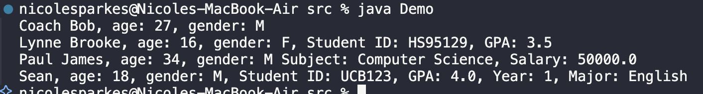
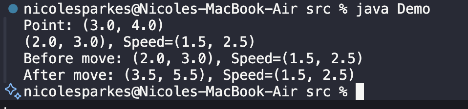
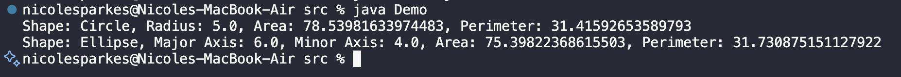

# QAP 3 - Java OOP Project

## 📌 Project Overview
This project implements object-oriented programming (OOP) concepts in Java, covering:
- **Inheritance** (`Person`, `Student`, `Teacher`, `CollegeStudent`)
- **Polymorphism** (`Shape`, `Circle`, `Ellipse`, `Triangle`)
- **Interfaces** (`Scalable`)
- **Testing with `Demo.java`**

## 📜 Files Included
- **src/**
  - `Person.java`
  - `Student.java`
  - `Teacher.java`
  - `CollegeStudent.java`
  - `Demo.java`
  - `Point.java`
  - `MovablePoint.java`
  - `Shape.java`
  - `Circle.java`
  - `Ellipse.java`
  - `Triangle.java`
  - `EquilateralTriangle.java`
  - `Scalable.java`

## 📷 Program Output Screenshot

### Problem 1 Output


### Problem 2 Output


### Problem 3 Output



## 🚀 How to Run
1. Navigate to the `src/` folder in the terminal.
2. Compile and run `Demo.java`:
   ```sh
   javac Demo.java
   java Demo
View the output in the terminal.
📷 Screenshots

Attach a screenshot of your output here.

📝 Student Feedback

1️⃣ How many hours did it take you to complete this assessment?
I spent roughly, 2.5 hours on the project.

2️⃣ What online resources did you use? (My lectures, YouTube, Stack Overflow, etc.)
I have referred to past lectures.

3️⃣ Did you need to ask any of your friends for help? If yes, mention their names.
No.

4️⃣ Did you ask your instructor any questions? If so, how many?
No.

5️⃣ Rate (subjectively) the difficulty of each problem and explain if you feel confident solving similar problems in the future.
I found the project to be fairly easy.
